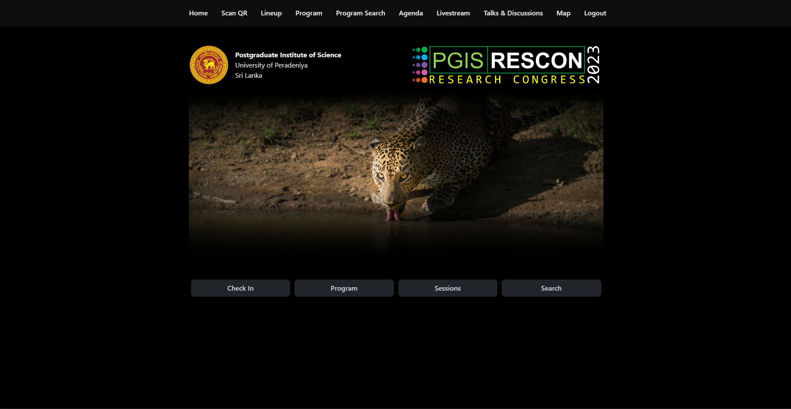
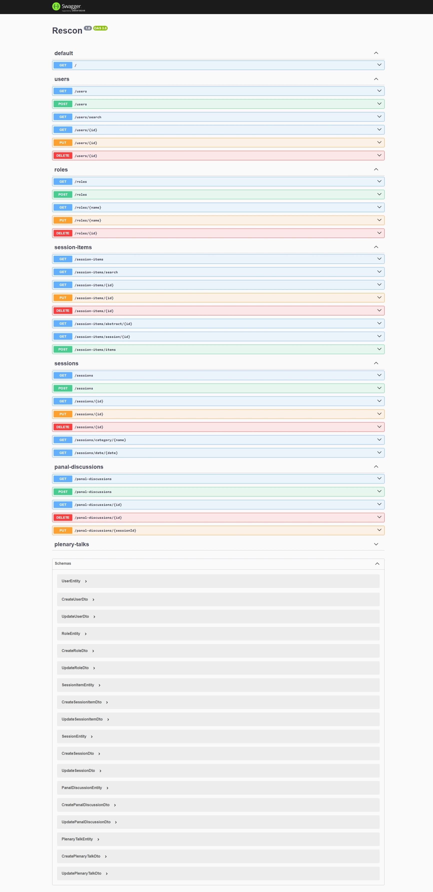
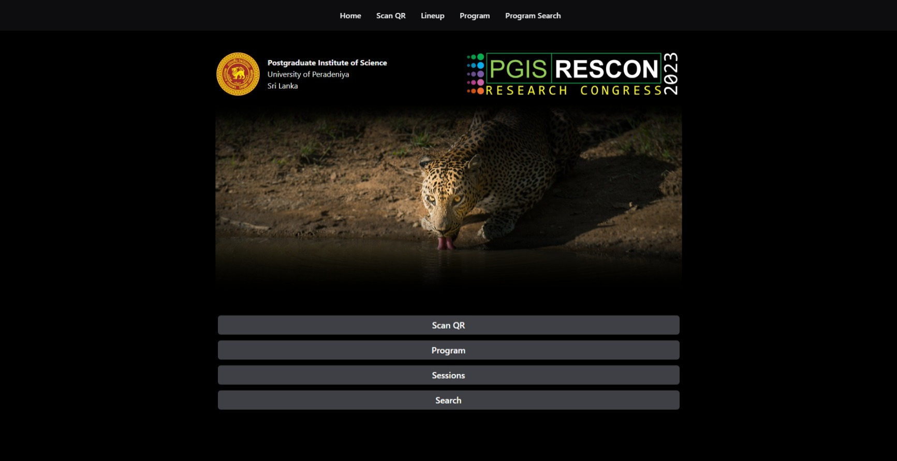
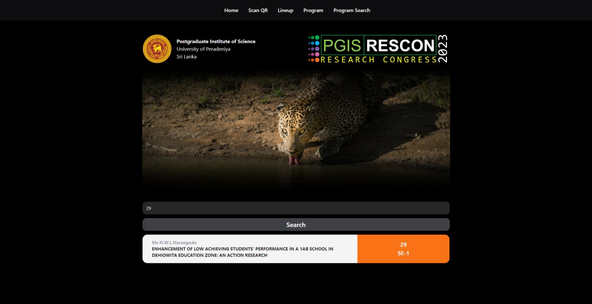
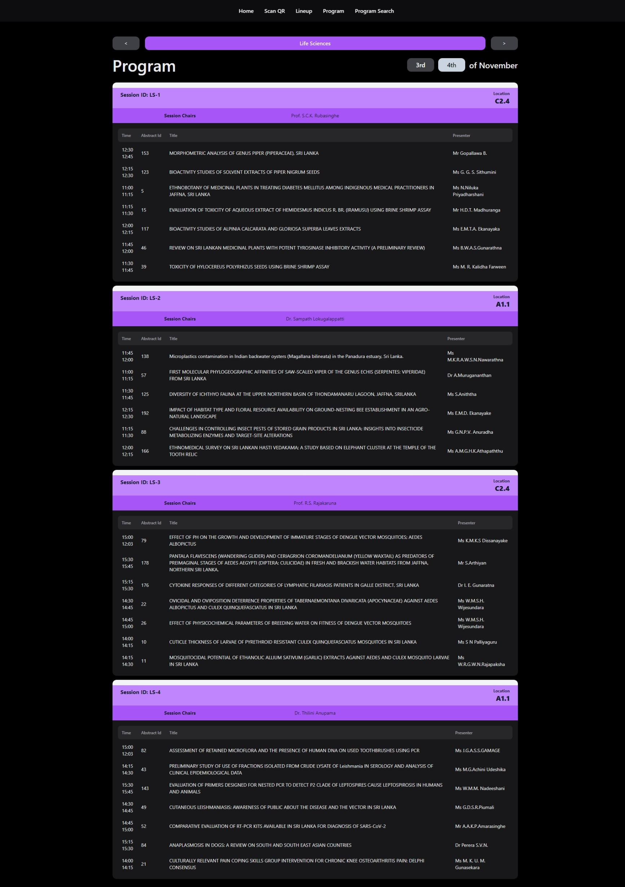
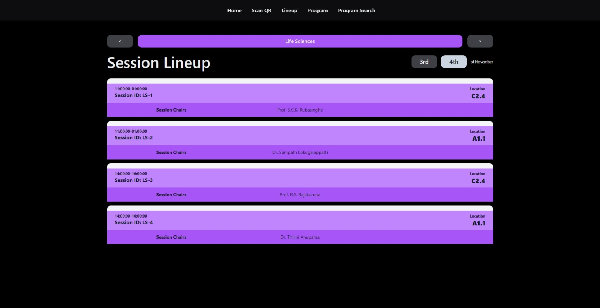
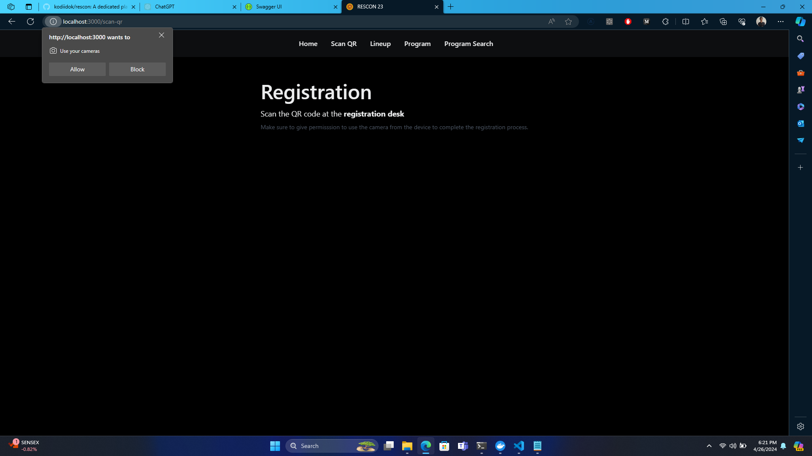

# RESCON

  

A utility application for session management in events. Primarily being developed as a dedicated platform for the annual research conference of PGIS, University of Peradeniya. Tailored for the university's research community, this app aims to enhance the conference experience by facilitating easy exploration of research and innovations.

## Tech Stack Overview

 - Backend Server: Nest.js
 - Frontend Server: Next.js
 - API architecture: REST
 - Database: PostgreSQL

## Setting up the development server

**Prerequisites**
- Node.js (14+)
- pnpm
- postgres or mysql

### Install dependencies
```
# clone the repo
https://github.com/kodiidok/rescon.git

# enable corepack
corepack enable

# go to frontend directory and install dependencies
pnpm install

# go to backend directory and install dependencies
pnpm install
```

### Configure Environment Variables

Create a `.env` file in the `backend/` directory and add the correct configurations for each variable.

```
DB="postgres"
DB_HOST="localhost"
DB_PORT=3003
DB_USERNAME="rescon"
DB_PASSWORD="rescon"
DB_NAME="rescon"
PORT=3333
UI="http://localhost:3000"
```

### Configure database
Change the database configuration file in `backend\libs\config\src\db\config.ts` to connect your database.  


If you prefer to use docker, a postgres database is already initialized with the current server. Use the `dev.docker-compose.yml` file to connect to it.


```
# go to the root of the project and start the docker container
docker compose -f dev.docker-compose up -d

# you can also provide credentials as environment variables (or an .env file)
POSTGRES_DB=database POSTGRES_USER=username POSTGRES_PASSWORD=password  docker-compose up -d
```

The docker database should start as follows.


To access the docker postgres database, use psql
```
psql -h localhost -p port -U username -d database
```

### Backup Sample Data

If you are using a standalone postgres server, then backup the database using the file `assets/db/backup.sql`. Make sure the version of postgres is 16.0

If you are using the docker container for the database,

```
# go to the assest folder, then copy the sql file to the docker container
cd assets/db
docker cp backup.sql rescon-postgres:/backup.sql

# access the docker container
docker exec -it rescon-postgres bash

# restore the backup
psql -U rescon -d rescon -f backup.sql
```

### Test the server in localhost

```
# go to frontend and run
pnpm dev

# go backend and run
pnpm start:dev
```

If the backend server doesn't connect to the database even with the correct credentials, provide the details of the database as environment variables when starting the app.

```
DB_HOST=localhost DB_PORT=port DB_USER=user DB_PASSWORD=password DB_NAME=rescon pnpm start:dev
```

Assuming the frontend port is 3000 and the backend port is 3333,

Frontend starts on `http://localhost:3000/`  
Backend starts on `http://localhost:3333/`  
Swagger starts on `http://localhost:3333/api/`

### API Testing

You can access the Swagger API via `http://localhost:3333/api/` to check the APIs.



## Interfaces

The current version of RESCON23 has the following interfaces. All these interfaces are optimized for both mobile and web views.


Title: RESCON Homepage
Description: This image showcases the homepage interface of RESCON23, featuring a user-friendly layout and intuitive navigation.


Title: RESCON Search Interface
Description: The search interface of RESCON23 allows users to easily search and find relevant content, enhancing user experience and accessibility.


Title: RESCON Program Lineup
Description: This image displays the program lineup interface of RESCON23, providing users with a comprehensive overview of scheduled events and sessions.


Title: RESCON Session Lineup
Description: The session lineup interface of RESCON23 enables users to view detailed information about upcoming sessions and presentations, aiding in planning and scheduling.


Title: RESCON QR Code Scanner
Description: This image illustrates the QR code scanning interface of RESCON23, allowing attendees to quickly access event information and resources using their mobile devices.

## Database Schema

```
rescon=# \dt
              List of relations
 Schema |       Name        | Type  | Owner
--------+-------------------+-------+--------
 public | panal_discussions | table | rescon
 public | plenary_talks     | table | rescon
 public | roles             | table | rescon
 public | session_chairs    | table | rescon
 public | session_items     | table | rescon
 public | sessions          | table | rescon
 public | users             | table | rescon
(7 rows)
```

```
rescon=# \d roles
                                 Table "public.roles"
   Column   |            Type             | Collation | Nullable |      Default
------------+-----------------------------+-----------+----------+--------------------
 id         | uuid                        |           | not null | uuid_generate_v4()
 created_at | timestamp without time zone |           | not null | now()
 updated_at | timestamp without time zone |           | not null | now()
 name       | text                        |           | not null |
Indexes:
    "PK_c1433d71a4838793a49dcad46ab" PRIMARY KEY, btree (id)
    "UQ_648e3f5447f725579d7d4ffdfb7" UNIQUE CONSTRAINT, btree (name)
Referenced by:
    TABLE "users" CONSTRAINT "FK_39f0c2dc962af79c0dabfed43eb" FOREIGN KEY (role_name) REFERENCES roles(name)
```

```
rescon=# \d users
                                     Table "public.users"
       Column        |            Type             | Collation | Nullable |      Default
---------------------+-----------------------------+-----------+----------+--------------------
 id                  | uuid                        |           | not null | uuid_generate_v4()
 created_at          | timestamp without time zone |           | not null | now()
 updated_at          | timestamp without time zone |           | not null | now()
 username            | character varying           |           | not null |
 email               | character varying           |           | not null |
 password            | character varying           |           | not null |
 name                | character varying           |           |          |
 role_name           | text                        |           |          |
 chairing_sessions   | text                        |           |          |
 nic                 | character varying           |           |          |
 presenting_sessions | text                        |           |          |
 institute           | character varying           |           |          |
 registered          | boolean                     |           |          |
 registeredAt        | character varying           |           |          |
 studentRegNo        | character varying           |           |          |
Indexes:
    "PK_a3ffb1c0c8416b9fc6f907b7433" PRIMARY KEY, btree (id)
Foreign-key constraints:
    "FK_39f0c2dc962af79c0dabfed43eb" FOREIGN KEY (role_name) REFERENCES roles(name)
Referenced by:
    TABLE "session_chairs" CONSTRAINT "FK_854f05eee1caae7decd9130d4d6" FOREIGN KEY (session_chair_id) REFERENCES users(id) ON UPDATE CASCADE ON DELETE SET NULL
    TABLE "session_items" CONSTRAINT "FK_adf2dab2d30bb46e4490a684182" FOREIGN KEY (presenter_id) REFERENCES users(id)
```

```
                                    Table "public.sessions"
        Column        |            Type             | Collation | Nullable |      Default
----------------------+-----------------------------+-----------+----------+--------------------
 id                   | uuid                        |           | not null | uuid_generate_v4()
 created_at           | timestamp without time zone |           | not null | now()
 updated_at           | timestamp without time zone |           | not null | now()
 start_time           | time without time zone      |           | not null |
 end_time             | time without time zone      |           | not null |
 date                 | date                        |           | not null |
 session_id           | character varying           |           | not null |
 session_chair_ids    | text                        |           |          |
 session_item_ids     | text                        |           |          |
 panal_discussion_ids | text                        |           |          |
 plenary_talk_ids     | text                        |           |          |
 category             | character varying           |           | not null |
 location             | character varying           |           |          |
Indexes:
    "PK_3238ef96f18b355b671619111bc" PRIMARY KEY, btree (id)
    "UQ_9340188c93349808f10d1db74a8" UNIQUE CONSTRAINT, btree (session_id)
Referenced by:
    TABLE "session_chairs" CONSTRAINT "FK_14e57012eb4717bd686b8cbaa24" FOREIGN KEY (session_id) REFERENCES sessions(session_id) ON UPDATE CASCADE ON DELETE SET NULL
    TABLE "plenary_talks" CONSTRAINT "FK_b06ba039733701745a59f162686" FOREIGN KEY (session_id) REFERENCES sessions(session_id) ON UPDATE CASCADE ON DELETE SET NULL
    TABLE "panal_discussions" CONSTRAINT "FK_c1a69c2661806c2e1c6fc4c77cf" FOREIGN KEY (session_id) REFERENCES sessions(session_id) ON UPDATE CASCADE ON DELETE SET NULL
    TABLE "session_items" CONSTRAINT "FK_fe6bd73f766fde90aa0854452b6" FOREIGN KEY (session_id) REFERENCES sessions(session_id) ON UPDATE CASCADE ON DELETE SET NULL
```

```
rescon=# \d session_items
                              Table "public.session_items"
    Column    |            Type             | Collation | Nullable |      Default
--------------+-----------------------------+-----------+----------+--------------------
 id           | uuid                        |           | not null | uuid_generate_v4()
 created_at   | timestamp without time zone |           | not null | now()
 updated_at   | timestamp without time zone |           | not null | now()
 start_time   | time without time zone      |           | not null |
 end_time     | time without time zone      |           | not null |
 title        | character varying           |           |          |
 presenter_id | uuid                        |           |          |
 session_id   | character varying           |           |          |
 abstract_id  | integer                     |           |          |
 via          | character varying           |           |          |
Indexes:
    "PK_93fe81b2d7f672603a7bf19382f" PRIMARY KEY, btree (id)
Foreign-key constraints:
    "FK_adf2dab2d30bb46e4490a684182" FOREIGN KEY (presenter_id) REFERENCES users(id)
    "FK_fe6bd73f766fde90aa0854452b6" FOREIGN KEY (session_id) REFERENCES sessions(session_id) ON UPDATE CASCADE ON DELETE SET NULL
```

```
rescon=# \d session_chairs
                     Table "public.session_chairs"
      Column      |       Type        | Collation | Nullable | Default
------------------+-------------------+-----------+----------+---------
 session_id       | character varying |           | not null |
 session_chair_id | uuid              |           | not null |
Indexes:
    "PK_9fdb892f2352662c17305e9ea34" PRIMARY KEY, btree (session_id, session_chair_id)
    "IDX_14e57012eb4717bd686b8cbaa2" btree (session_id)
    "IDX_854f05eee1caae7decd9130d4d" btree (session_chair_id)
Foreign-key constraints:
    "FK_14e57012eb4717bd686b8cbaa24" FOREIGN KEY (session_id) REFERENCES sessions(session_id) ON UPDATE CASCADE ON DELETE SET NULL
    "FK_854f05eee1caae7decd9130d4d6" FOREIGN KEY (session_chair_id) REFERENCES users(id) ON UPDATE CASCADE ON DELETE SET NULL
```

```
rescon=# \d panal_discussions
                           Table "public.panal_discussions"
   Column   |            Type             | Collation | Nullable |      Default
------------+-----------------------------+-----------+----------+--------------------
 id         | uuid                        |           | not null | uuid_generate_v4()
 created_at | timestamp without time zone |           | not null | now()
 updated_at | timestamp without time zone |           | not null | now()
 session_id | character varying           |           |          |
 start_time | time without time zone      |           | not null |
 end_time   | time without time zone      |           | not null |
Indexes:
    "PK_0070f61d6c0250b79d657116298" PRIMARY KEY, btree (id)
Foreign-key constraints:
    "FK_c1a69c2661806c2e1c6fc4c77cf" FOREIGN KEY (session_id) REFERENCES sessions(session_id) ON UPDATE CASCADE ON DELETE SET NULL
```

```
rescon=# \d plenary_talks
                             Table "public.plenary_talks"
   Column   |            Type             | Collation | Nullable |      Default
------------+-----------------------------+-----------+----------+--------------------
 id         | uuid                        |           | not null | uuid_generate_v4()
 created_at | timestamp without time zone |           | not null | now()
 updated_at | timestamp without time zone |           | not null | now()
 start_time | time without time zone      |           | not null |
 end_time   | time without time zone      |           | not null |
 presenter  | character varying           |           | not null |
 location   | character varying           |           | not null |
 session_id | character varying           |           |          |
Indexes:
    "PK_628280c767ffe7c897d7576e110" PRIMARY KEY, btree (id)
Foreign-key constraints:
    "FK_b06ba039733701745a59f162686" FOREIGN KEY (session_id) REFERENCES sessions(session_id) ON UPDATE CASCADE ON DELETE SET NULL
```