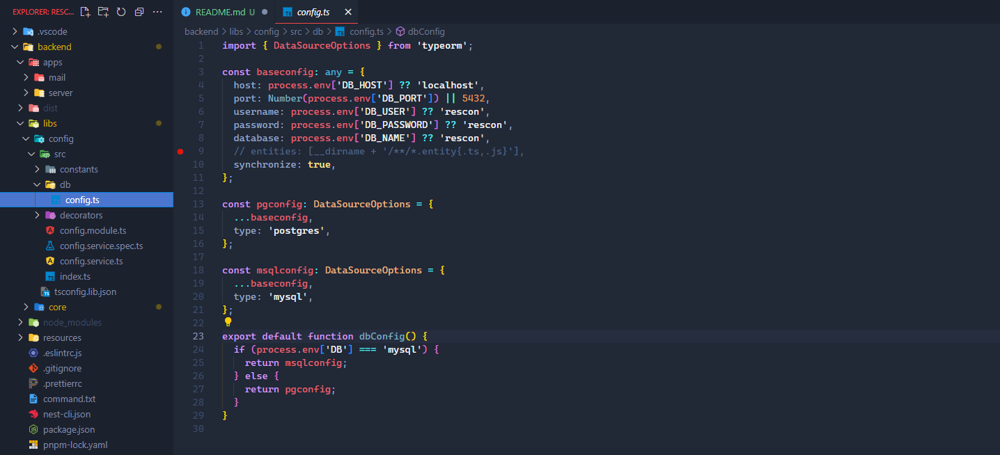
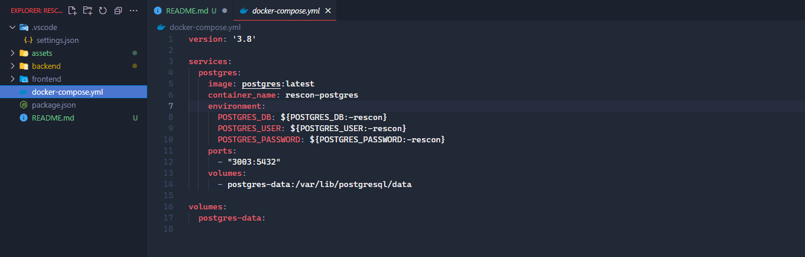
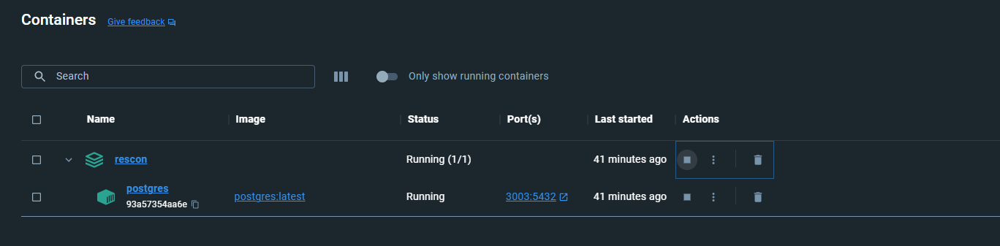

# RESCON
A utility application for session managements in events. Primarily being developed as a dedicated platform for the annual research conference of PGIS, University of Peradeniya. Tailored for the university's research community, this app aims to enhance the conference experience by facilitating easy exploration of researches and innovations.

## Setting up the development server

**Prerequisites**
- Node.js (14+)
- pnpm
- postgres or mysql

### Install dependencies
```
# clone the repo
https://github.com/kodiidok/rescon.git

# enable corepack
corepack enable

# go to frontend directory and install dependencies
pnpm install

# go to backend directory and install dependencies
pnpm install
```

### Configure database
Change the database configuration file in `backend\libs\config\src\db\config.ts` to connect your database.  



If you prefer to use docker, a postgres database is already initialized with the current server. User the `docker-compose.yml` file to connect to it.



```
# go to the root of the project and start the docker container
docker-compose up -d

# you can also provide credentials as environment variables (or an .env file)
POSTGRES_DB=database POSTGRES_USER=username POSTGRES_PASSWORD=password  docker-compose up -d
```

The docker database should start as follows.



To access the docker postgres database, use psql
```
psql -h localhost -p port -U username -d database
```

### Test the server in localhost

```
# go to frontend and run
pnpm dev

# go backend and run
pnpm start:dev
```

If the backend server doesn't connect to the database even with the correct credentials, provide the details of the database as environment variables when starting the app.

```
DB_HOST=localhost DB_PORT=port DB_USER=user DB_PASSWORD=password DB_NAME=rescon pnpm start:dev
```

Assuming the frontend port is 3000 and the backend port is 3333,

Frontend starts on `http://localhost:3000/`  
Backend starts on `http://localhost:3333/`  
Swagger starts on `http://localhost:3333/api/`